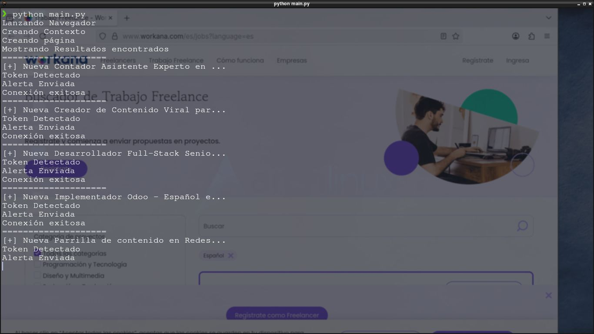
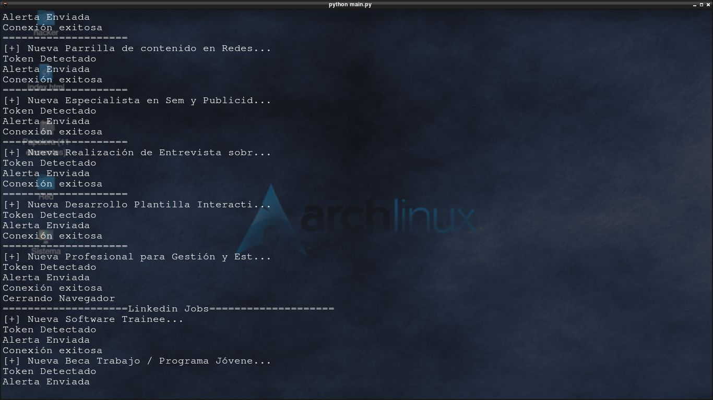

# 🕷️ Vigía Jobs - Monitor de Empleos Asíncrono

Un sistema inteligente de Web Scraping que monitorea múltiples portales de empleo simultáneamente y envía
alertas en tiempo real a Telegram.

## 📋 Descripción

**Vigía Jobs** es una herramienta diseñada para automatizar la búsqueda de empleo. Utiliza una arquitectura 
híbrida (Requests + Playwright) para extraer datos tanto de sitios estáticos como dinámicos.

El sistema cuenta con una base de datos local que genera huellas digitales (Hashes) de cada oferta para evitar
duplicados, notificando al usuario vía Telegram únicamente cuando aparece una oferta verdaderamente nueva.

## ✨ Características Principales

**⚡ Arquitectura Asíncrona:** Ejecuta múltiples arañas (spiders) en paralelo sin bloqueos.

**🕵️ Evasión de Bots:** Implementa técnicas de camuflaje (User-Agents, modificación de navigator.webdriver)
para evitar bloqueos en sitios protegidos (como Computrabajo).

**💾 Persistencia Inteligente:** Base de datos SQLite con detección de duplicados basada en Hash (MD5 de Título + URL)

**📱 Alertas en Tiempo Real:** Notificaciones HTML formateadas directamente a tu Telegram.

**🧩 Diseño Modular:** Fácil de escalar. Agregar un nuevo portal es tan simple como crear una nueva clase
hija.

## 🛠️ Tecnologías Utilizadas

**Python 3.x**

**Playwright:** Para scraping dinámico (renderizado JS).

**Requests + BeautifulSoup4:** Para scraping estático (alta velocidad).

**Aiogram:** Para la integración con la API de Telegram.

**SQLite3:** Base de datos ligera incorporada.

**Dotenv:** Gestión de variables de entorno.

# 🚀 Instalación y Configuración

1. Clonar el repositorio

	git clone [https://github.com/alejandroxyz/vigia-jobs.git](https://github.com/alejandroxyz/vigia-jobs.git)
	cd vigia-jobs

2. Instalar dependencias

	pip install -r requirements.txt	
	playwright install firefox

3. Configurar Variables de Entorno

Crea un archivo .env en la raíz del proyecto y agrega tus credenciales:

## .env
	Token=TU_TOKEN_DE_TELEGRAM_AQUI
	chat_id=TU_ID_DE_TELEGRAM_AQUI

**Nota: Puedes obtener tu chat_id hablando con @userinfobot en Telegram.**

## ▶️ Uso

Simplemente ejecuta el archivo principal:

	python main.py

El script:

Inicializará la base de datos (si no existe).

Lanzará los navegadores y peticiones en paralelo.

Comparará los resultados con el historial.

Te enviará un mensaje a Telegram solo si encuentra ofertas nuevas.

## 🤝 Contribución

Si quieres agregar un nuevo portal (ej. Indeed o Glassdoor):

Crea un archivo en spiders/.

Hereda de spider_base.Dinamica o spider_base.Estatica.

Implementa el método extraer.

Agrégalo a la lista de arañas en main.py.
